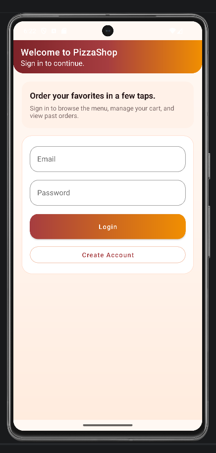
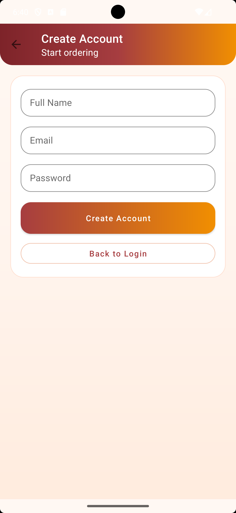
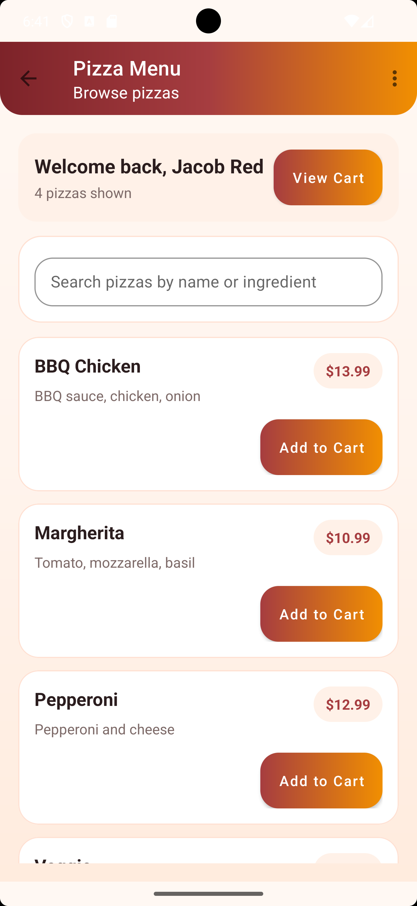
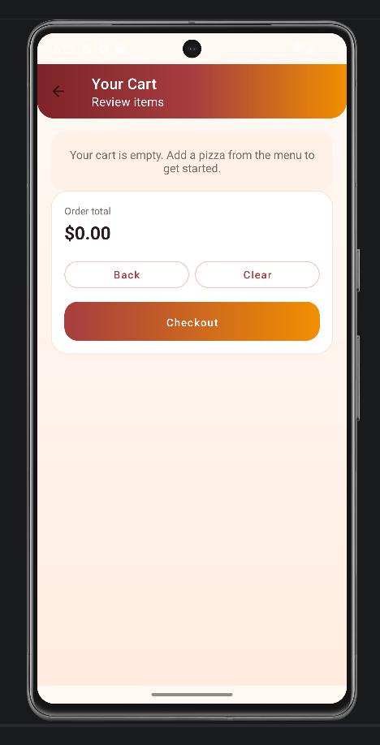
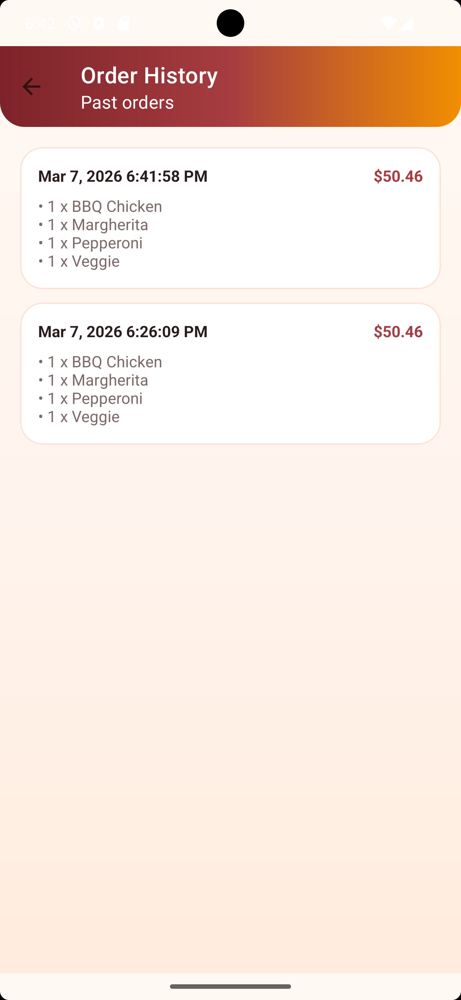
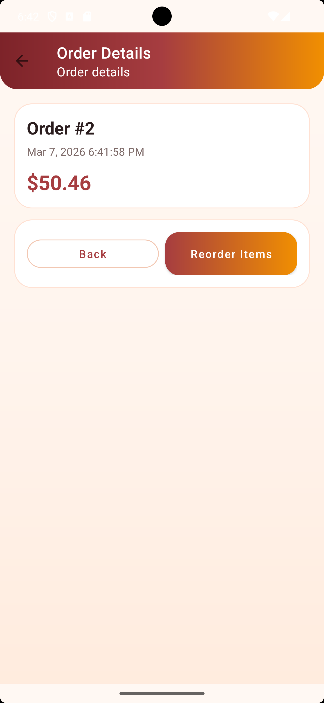

# PizzaShop Android Mobile App

PizzaShop is an Android mobile ordering application built with Java and Android Studio. The project demonstrates a layered mobile architecture using Room, DAO interfaces, repository-based data access, and multiple user workflows including login, cart management, checkout, and order history.

## Highlights

- User login and registration flow
- Searchable pizza menu
- Shopping cart with quantity controls
- Checkout flow with saved order history
- Order detail screen with reorder support
- Local persistence using Room database
- APK distribution previously supported through Firebase hosting

## Tech Stack

- **Language:** Java
- **Frameworks / Libraries:** Android Studio, Material Components, Room
- **Architecture:** Activities, repository pattern, DAO pattern, entity-based Room models
- **Data Storage:** SQLite via Room

## Architecture Overview

```text
UI Layer (Activities + RecyclerView adapters)
        ↓
Repository Layer
        ↓
DAO Interfaces
        ↓
Room Database
```

Core data models include `Customer`, `Pizza`, `CartItem`, `Order`, and `OrderItem`.

## Recent Portfolio Improvements

- Refined the visual design with a more polished Material-inspired interface
- Kept menu search functionality as a first-class feature in the experience
- Improved cart interactions with cleaner quantity controls and checkout feedback
- Reframed the project from a school capstone into a portfolio-ready Android app

## Screenshots

## Screenshots

| Login | Account Creation |
|------|------|
|  |  |

| Menu | Cart |
|------|------|
|  |  |

| Order History | Order Details |
|------|------|
|  |  |

## Running the Project

1. Open the project in Android Studio.
2. Allow Gradle sync to complete.
3. Build and run on an emulator or Android device.

## Notes

This application began as a Software Engineering capstone project and is now being refined as a public portfolio project to better showcase Android development, UI cleanup, and application architecture.
